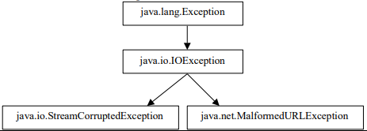

# TD: Interface et exceptions
## Exercice 1: Interface et implémentation

**Question 1:** Ecrire le code d’une interface `AStackV2` contenant les méthodes classiques des Piles :

- `isEmpty` qui teste si la pile est vide;
- `push` qui ajoute un objet au sommet de la pile. (Attention si la pile est pleine, dans le cas d’une pile à contenance finie, il y a levée d’une exception de type `FullStackException` fille de la classe Exception que vous devez créer pour l’occasion).
- `peek` qui retourne l’objet du sommet de la pile, sans toute fois l’enlever de la pile (Attention si la pile est vide il y a levée d’une exception de type `EmptyStackException` fille de la classe `RuntimeException` existant dans le JDK).
- `pop` qui retourne et retire l’objet qui est au sommet de la pile (Attention si la pile est vide il y a levée d’une exception de type `EmptyStackException`).

**Question 2:** On vous modifier votre classe `ConcreteStackArray` qui implémente cette interface `AStackV2`.
**Question 3:** Testez cette classe dans un main en créant une nouvelle pile, empilez quelques éléments de votre choix, dépilez… bref écrivez au moins une fois un appel à toutes les méthodes que vous avez écrites précédemment en traitant comme il se doit les éventuelles exceptions. 

## Exercice 2: QCM sur les exceptions

1. Consider these classes, defined in separate source files:
   ```java
   public class Test1 {
        public float aMethod(float a, float) throws IOException {}
   } 

    public class Test2 extends Test1 {}
   ```
   Which of the following methods would be legal (individually) at line 2 in class Test2 ?

   - [x] `float aMethod(float a, float b) { }`
   - [ ] `public int aMethod(int a, int b) throws Exception{ }`
   - [ ] `public float aMethod(float a, float b) throws _Exception { }`
   - [x] `public float aMethod(float p, float q) { }`

2. Quelle sera la sortie si vous compilez et exécutez ce code, sachant qu'il n'existe pas de fichier nommé `Hello.txt` dans le répertoire courant ?
    ```java
    import java.io.*;
    public class Mine {
        public int amethod() {
            try {
                FileInputStream dis=new FileInputStream("Hello.txt");
            } catch (FileNotFoundException fne) {
                System.out.println("Fichier non trouvé, ");
                return -1;
            } catch(IOException ioe) {}
            finally{
                System.out.println("Exécution de finally, ");
            }

            return 0;
        }

        public static void main(String argv[]){
            Mine m=new Mine();
            System.out.println(m.amethod());
        }
    }
    ```

    - [ ] Fichier non trouvé,
    - [ ] Fichier non trouvé, -1
    - [x] Fichier non trouvé, Exécution de finally, -1
    - [ ] 0

3. Soit le code suivant:
    ```java
    import java.io.*;

    public class Test{
        public static void main(String argv[]){
            Test t = new Test();
            t.amethod();
        }

        public void amethod(){
            try{
                ioCall();
            } catch(IOException ioe){}
        }
    } 
    ```
    Quel pourrait être le code de la méthode ioCall?

    - [x] 

        ```java
        public void ioCall() throws IOException{
            DataInputStream din = new DataInputStream(System.in);
            din.readChar();
        }
        ```
    - [x] 

        ```java
        public void ioCall() throw IOException{
            DataInputStream din = new DataInputStream(System.in);
            din.readChar();
        }
        ```
    - [ ] 
    
        ```java
        public void ioCall(){
            DataInputStream din = new DataInputStream(System.in);
            din.readChar();
        }
        ```
    
4. Soit le code suivant :
    ```java
    class ThreeException extends Exception {
    }

    public class FinallyWorks {
        static int count = 0;

        public static void main(String argv[]) {
            while (true) {
                try {
                    if (count++ == 0)
                        throw new ThreeException();
                    System.out.println("No Exception");
                } catch (ThreeException e) {
                    System.err.println("ThreeException");
                } finally {
                    System.err.println("In finally clause");
                    if (count == 2)
                        break;
                }
            }
        }
    }
    ```

    Quelle sera la sortie écran?

    <div style="font-family: 'fira code retina'; color: blue; width: 100%; padding: 0.5em; border: none; border-radius: 0.25rem; background-color: #F5F5F5;">
    No Exception,
    In finally clause
    </div>

5. Cette construction de code est elle correcte ?
    ```java
    try {
        ...
    } finally {
        ...
    }
    ```
    <div style="font-family: 'fira code retina'; color: blue; width: 100%; padding: 0.5em; border: none; border-radius: 0.25rem; background-color: #F5F5F5;">
    Oui, cependant elle va tout de même propager les exceptions qui apparaitrons dans le bloc try.
    </div>

6. Quelles sont les types d'exception qui peuvent être attrapées par ce `catch` ?
    ```java
    catch(Exception e) {
        ...
    }
    ```
    Est-ce judicieux d'écrire ce genre de catch?
    <div style="font-family: 'fira code retina'; color: blue; width: 100%; padding: 0.5em; border: none; border-radius: 0.25rem; background-color: #F5F5F5;">
    Toutes les Exceptions seront attrapé par ce bloc catch.
    Il est judicieux d'utiliser ce genre de catch pour être sure de ne pas laisser filtrer d'exception à la seul conditions que ce soit la derniere clause catch.
    </div>

7. Quelles sont les exceptions qui peuvent être interceptées par le code suivant ?
    ```java
    catch (Exception e) {
        ...
    } catch (ArithmeticException a) {
        ...
    }
    ```
    Ce code est-il valide? Va-t-il compiler?
    <div style="font-family: 'fira code retina'; color: blue; width: 100%; padding: 0.5em; border: none; border-radius: 0.25rem; background-color: #F5F5F5;">
    Toutes les exceptions seront attrapé par le simple fait qu'elle hérite toutes de la classe Exception. La clause catch(ArithmeticException) quand à elle ne sera jamais éxécuter.
    </div>

8. Given the following method body:
    ```java
    {
        if (atest()) {
            unsafe();
        } else {
            safe();
        }
    }
    ```
    La méthode "unsafe" peut propager une exception AWTException (qui n'est pas une fille de RunTimeException). Quelle sera parmi les déclarations suivantes la déclaration pouvant correspondre à la méthode dont le code est donné ci-dessus ?
    - [ ] `public AWTException methodName()`
    - [ ] `public void methodName()`
    - [ ] `public void methodName() throw AWTException`
    - [x] `public void methodName() throws AWTException`
    - [ ] `public void methodName() throws Exception`

9. Quel est le résultat de la compilation et exécution du code suivant (une ou plusieurs réponse(s))?
    ```java
    import java.io.*;

    class MyExp {
        void myMethod() throws IOException, EOFException {
            // ............//}
        }

        class MyExp1 extends MyExp {
            void myMethod() {
                // ..........//
            }
        }
    }

    public class MyExp2 extends MyExp1 {
        void myMethod() throws IOException {
            // .........//
        }
    }
    ```

    - [ ] Erreur de compilation
    - [ ] Pas d’erreur de compilation
    - [ ] Erreur à l’exécution
    - [ ] `MyMethod()` ne peut propager une `IOException` dans `MyExpr2`
    - [ ] `MyMethod()` doit propager les `IOExeption` et les EOFException dans `MyExpr1`

10. Soit la hiérarchie de classes et le fragment de code suivant :
    
    ```java
    try{
        // on suppose que s est précédemment défini
        URL u = new URL(s);
        // in est un ObjectInputStream
        Object o = in.readObject();
        System.out.println("Réussite");
    } catch(MalformedURLException e) {
        System.out.println("Mauvaise URL");
    } catch(StreamCorruptedException e) {
        System.out.println("Contenu de fichier incorrect");
    } catch(Exception e) {
        System.out.println("Exception générale");
    } finally {
        System.out.println("Exécution de la partie finally");
    }
    System.out.println("On continue…”);
    ```
    Quels seront le ou les messages affichés en sortie écran si une MalformedURLException est levée lors de la tentative de construction de l’URL à la ligne 3

    - [ ] Réussite
    - [x] Mauvaise URL
    - [ ] Contenu de fichier incorrect
    - [ ] Exécution de la partie finally
    - [ ] On continue…

    En reprenant le même code et la même hiérarchie de classe que la question précédente, quels seront le ou les messages affichés en sortie écran si tout s’exécute normalement sans lever aucune exception ?

    - [x] Réussite
    - [ ] Mauvaise URL
    - [ ] Contenu de fichier incorrect
    - [x] Exécution de la partie finally
    - [x] On continue…

11. Quel est le résultat de la compilation et exécution du code
    ```java
    public class Foo {
        public static void main(String[] args) {
            try {
                return;
            } finally {
                System.out.println("Finally");
            }
        }
    }
    ```

    - [x] Affichage de « Finally »
    - [ ] Erreur de compilation
    - [ ] Erreur à l’exécution
    - [ ] Le code s’exécute sans affichage de sortie

12. Quel est le résultat de la compilation et exécution du code ci-dessous ?
    ```java
    public class X {
        public static void main(String[] args) {
            try {
                badMethod();
                System.out.print("A");
            } catch (Exception ex) {
                System.out.print("B");
            } finally {
                System.out.print("C");
            }
            System.out.print("D");
        }

        public static void badMethod() {
            throw new Error(); /* Line 22 */
        }
    }
    ```

    - [ ] Affichage de « ABCD »
    - [ ] Erreur de compilation
    - [ ] Affichage de « C » avant sortie sur une erreur
    - [ ] Affichage de « BC » avant sortie sur erreur d’exécution

13. Quel est le résultat de la compilation et exécution du code ci-dessous ?
    ```java
    public class X{
        public static void main(String [] args){
            try {
                badMethod();
                System.out.print("A");
            } catch (RuntimeException ex) { /* Line 10 */
                System.out.print("B");
            } catch (Exception ex1) {
                System.out.print("C");
            } finally {
                System.out.print("D");
            }
            System.out.print("E");
        }

        public static void badMethod()
        {
            throw new RuntimeException();
        }
    }
    ```

    - [x] Affichage de « BD »
    - [ ] Affichage de « BCD »
    - [ ] Affichage de « BDE
    - [ ] Affichage de « BCDE » 